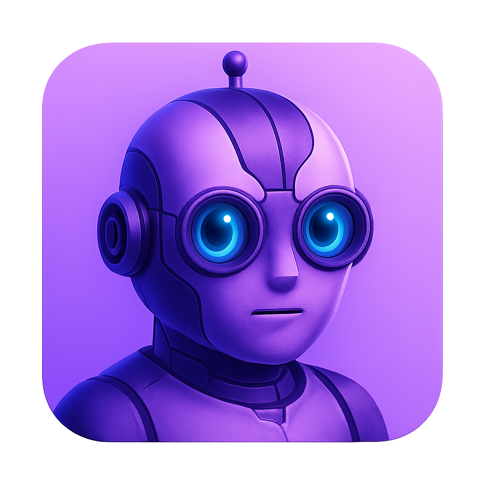

# Agent

[](https://github.com/tuist/agent/actions/workflows/swift.yml)


[](LICENSE)

Agent is a Swift SDK for Apple applications that enables easy integration with various AI APIs (Claude, ChatGPT, and custom servers) to build agentic features. It provides a unified interface for different AI backends with support for tool use, allowing you to create powerful AI agents that can execute actions and interact with users.

## Features

- 🔌 **Multiple Backend Support**: Claude (Anthropic), OpenAI/ChatGPT, and custom server backends
- 🔄 **Streaming Support**: Real-time streaming responses for better user experience
- 🔒 **Flexible Authentication**: Use API keys directly or proxy through your own server
- 💬 **Conversation Management**: Built-in conversation history and context management
- 🛠️ **Tool Use**: Build agents that can execute tools and actions
- 👤 **User Interaction**: Support for interactive conversations with user input
- 🧪 **Fully Tested**: Comprehensive test suite using Swift Testing framework
- 📱 **Multi-Platform**: Works on iOS, macOS, tvOS, and watchOS

## Installation

### Swift Package Manager

Add Agent to your `Package.swift` file:

```swift
dependencies: [
    .package(url: "https://github.com/tuist/agent.git", from: "1.0.0")
]
```

Or add it through Xcode:
1. File → Add Package Dependencies...
2. Enter: `https://github.com/tuist/agent.git`

## Usage

### Quick Start

Here's how to get started with the Agent SDK:

### Basic Usage with Claude

```swift
import Agent

// Create an agent with Claude backend
let agent = Agent.withClaude(
    apiKey: "your-api-key",
    model: "claude-3-opus-20240229", // optional, defaults to claude-3-opus
    systemPrompt: "You are a helpful assistant" // optional
)

// Send a message
let response = try await agent.sendMessage("Hello, Claude!")
print(response)

// Stream a response
for try await chunk in agent.streamMessage("Tell me a story") {
    print(chunk, terminator: "")
}
```

### Using OpenAI/ChatGPT

```swift
let agent = Agent.withOpenAI(
    apiKey: "your-openai-api-key",
    model: "gpt-4", // optional, defaults to gpt-4
    systemPrompt: "You are a creative writer"
)

let response = try await agent.sendMessage("Write a haiku about Swift")
```

### Using a Custom Server

Perfect for keeping your API keys secure on your server:

```swift
let agent = Agent.withCustomServer(
    baseURL: URL(string: "https://your-server.com/api")!,
    headers: ["Authorization": "Bearer your-auth-token"], // optional
    systemPrompt: "You are a domain expert"
)

let response = try await agent.sendMessage("Analyze this data...")
```

### Tool Use

```swift
// Create an agent with tools
let agent = Agent.withClaude(
    apiKey: "your-api-key",
    systemPrompt: "You are a helpful assistant with access to tools"
)

// Add tools to the agent
agent.addTool(CalculatorTool())
agent.addTool(FileReaderTool())
agent.addTool(WebSearchTool())

// The agent will automatically use tools when needed
let response = try await agent.sendMessage("What is 42 * 73?")
// The agent will use the calculator tool to compute the result

// Set up user input handler for interactive conversations
agent.setUserInputHandler { question in
    print("Assistant asks: \(question)")
    return readLine() ?? ""
}

// Add a tool that can ask the user questions
let userTool = UserInputTool(agent: agent)
agent.addTool(userTool)
```

### Creating Custom Tools

```swift
struct WeatherTool: Tool {
    let name = "get_weather"
    let description = "Get the current weather for a location"

    var inputSchema: ToolInputSchema {
        ToolInputSchema(
            properties: [
                "location": PropertySchema(
                    type: "string",
                    description: "The city and country, e.g. 'London, UK'"
                )
            ],
            required: ["location"]
        )
    }

    func execute(input: [String: Any]) async throws -> String {
        guard let location = input["location"] as? String else {
            throw AgentError.invalidResponse
        }

        // Call weather API here
        return "The weather in \(location) is sunny and 22°C"
    }
}
```

### Advanced Usage

```swift
// Access conversation history
let messages = agent.messages
for message in messages {
    if let content = message.content {
        print("\(message.role): \(content)")
    }
}

// Clear conversation while keeping system prompt
agent.clearConversation()

// Get conversation ID
let conversationId = agent.conversationId
```

### Custom Backend Implementation

You can create your own backend by conforming to the `AgentBackend` protocol:

```swift
struct MyCustomBackend: AgentBackend {
    func sendMessage(_ message: String, conversation: Conversation, tools: [Tool]) async throws -> BackendResponse {
        // Your implementation
        // Return BackendResponse with content and/or tool calls
    }

    func streamMessage(_ message: String, conversation: Conversation, tools: [Tool]) -> AsyncThrowingStream<StreamChunk, Error> {
        // Your streaming implementation
        // Yield .content(String) for text chunks
        // Yield .toolCall(ToolCall) for tool invocations
    }
}

let customBackend = MyCustomBackend()
let agent = Agent(backend: customBackend, tools: [CalculatorTool()])
```

## Server Implementation Guide

When using the custom server backend, your server should implement the following endpoints:

### POST /chat
- Request body: `{ conversationId: string, messages: [{ role: string, content: string }] }`
- Response: `{ content: string }`

### POST /chat/stream
- Request body: Same as `/chat`
- Response: Server-sent events (SSE) stream
- Event format: `data: { "content": "chunk" }\n\n`
- End stream with: `data: [DONE]\n\n`

## Error Handling

Agent provides specific error types for different scenarios:

```swift
do {
    let response = try await agent.sendMessage("Hello")
} catch AgentError.authenticationError {
    print("Invalid API key")
} catch AgentError.rateLimitExceeded {
    print("Rate limit hit, please wait")
} catch AgentError.networkError(let message) {
    print("Network error: \(message)")
} catch {
    print("Unexpected error: \(error)")
}
```

## Testing

Run the test suite:

```bash
swift test
```

## Requirements

- Swift 6.1+
- iOS 15.0+ / macOS 12.0+ / tvOS 15.0+ / watchOS 8.0+

## License

Agent is released under the MIT License. See [LICENSE](LICENSE) for details.

## Contributing

We welcome contributions! Please see our [Contributing Guide](CONTRIBUTING.md) for details.

## Acknowledgments

Built with ❤️ by the [Tuist](https://tuist.dev) team.
